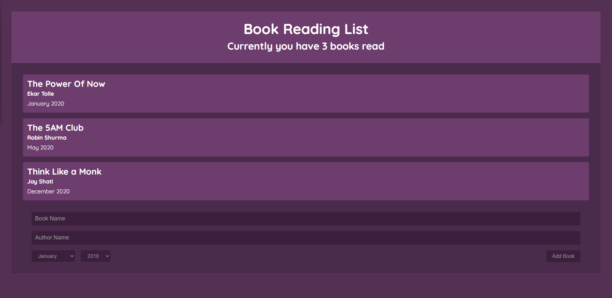

# Book List | React App 

# createContext + useContext + useReducer + useEffect 

## Focus on using context the the component tree.

## Topic of Focus:
- useReducer with BookReducer function
- Wrap up all components by the Context Provider Components
- Use { props.children } at context creating time
- Object Destructuring at receiver level components 
- Generally use sending objects from Context Provider Components

